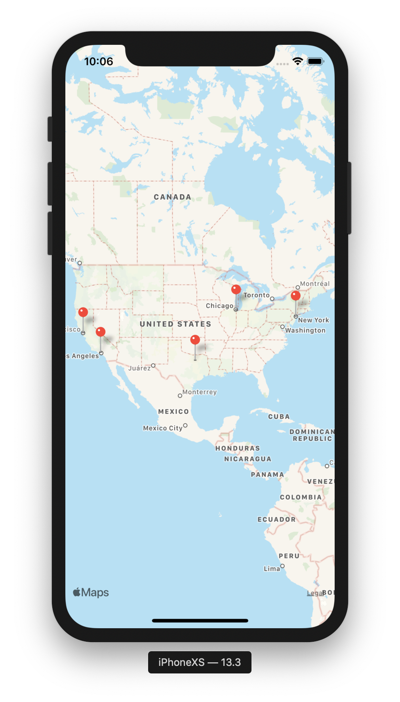
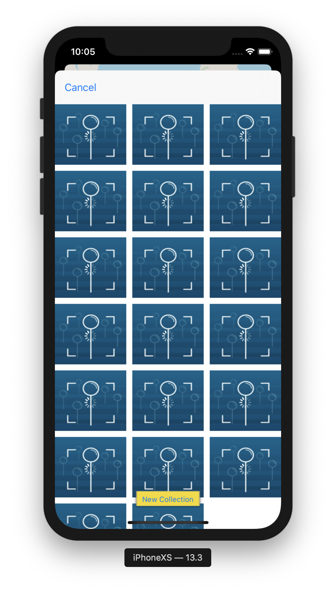
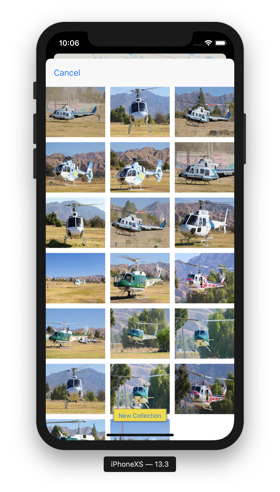

# FlickrAlbumApp, iOS Developer: Elias Hall

**Run Instructions:** Xcode 10.3/11.3, iPhone XS/iPhone 11 Pro, light mode, portrait only

**Overview:** 
This is an app for tourists to download and view Flickr photos at a specific location. The locations and photos are persisted in Core Data.

**Important concepts used:** 
URL Session, Core Data, GCD Concurrency, Gesture Recongizer(long-hold), MK Annotations

**Walkthrough:**
User chooses location on map by scroll and zoom. User uses long hold gusture to select specific location. Pin then appears at selected location. User taps pin, and album is presented. flickr photos belonging to the coordinates of that selected location are downloaded into the album. The pins in the mapview and the photos in the album are persisted in core data.

**Tools used:** 
**Xcode 10.3/11.3, iPhone XS/11 Pro, UIKit, MapKit, Core Data

**Select below for larger and clearer image**

